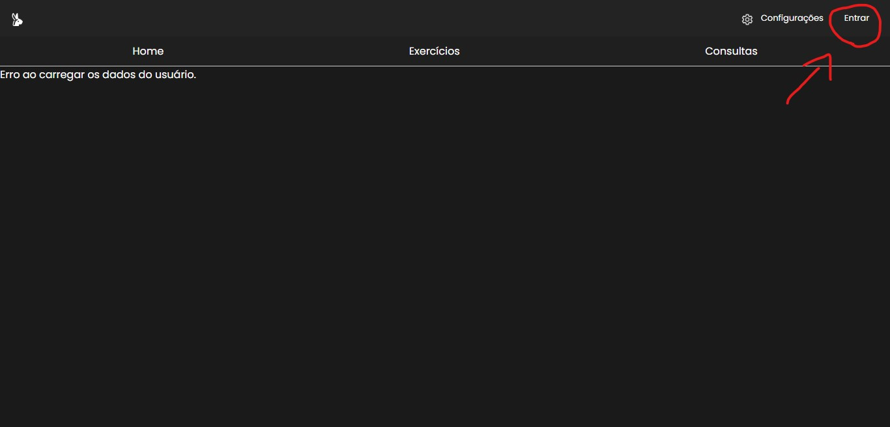
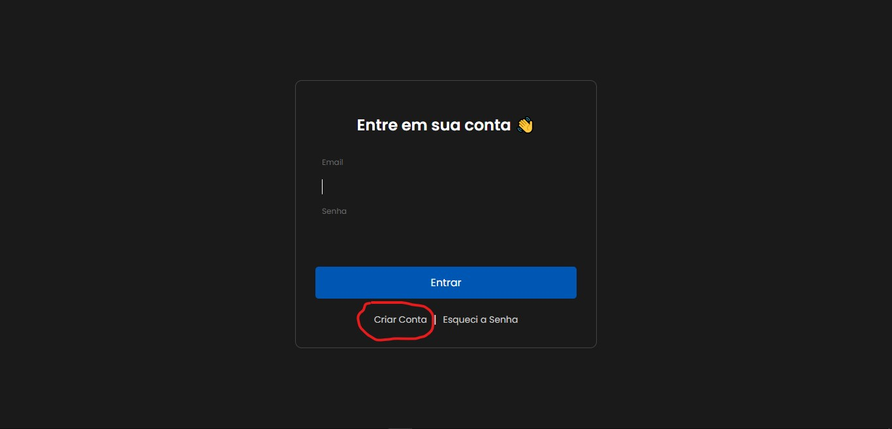
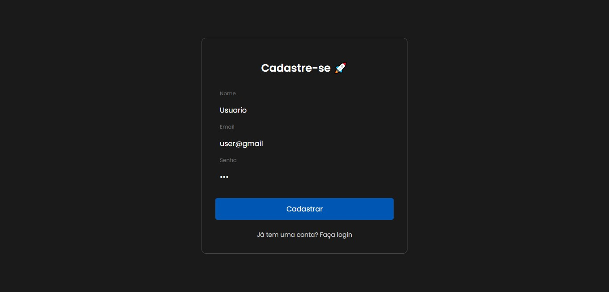
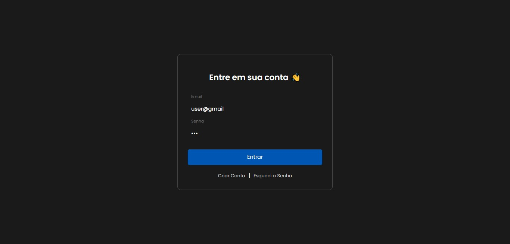
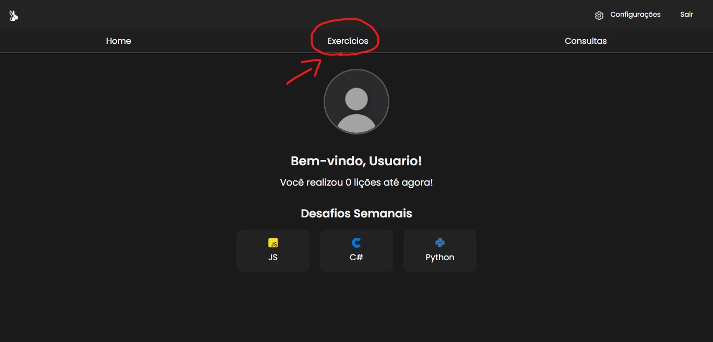
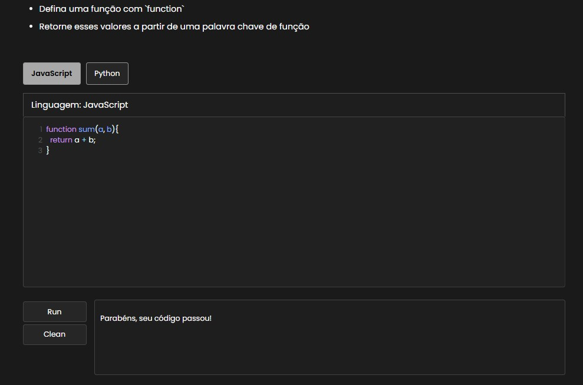

# Code Runner 

Um website aonde ajuda pessoas iniciantes na área de programação com exercícios simples


## Objetivo

Este projeto foi desenvolvido como parte do meu TCC, com a proposta de criar um sistema que solucionasse um problema real na área da tecnologia ou no ambiente escolar. O Code Runner nasceu da ideia de ajudar iniciantes em programação a aprimorarem sua lógica de programação de forma prática e interativa.

A infraestrutura do projeto consiste em:
- Um server mongoDB em docker
- Uma aplicação backend escrita em Node.js e javascript
- Uma aplicação frontend escrita em React e javascript
## Tecnologias

- Docker & Docker Compose
- Node.js
- React
- MongoDB
- Javascript


## Repositório remoto

O repositório remoto do projeto está disponível no GitHub. Você pode acessá-lo em: https://github.com/EzzFelt/Code-Runner
## Pré-condição

Antes de iniciar, certifique-se de ter os seguintes requisitos atendidos:

- Docker instalado na sua máquina.

- Git instalado para clonar o repositório.

Clone o repositório

```
git clone git@github.com:EzzFelt/Code-Runner.git
```
Substitua <SEU_NOME> pelo seu usuário do GitHub.
## Estrutura de pasta

Certifique-se de que a estrutura de pasta do projeto esteja organizada da seguinte forma:

``` bash
CodeRunner/
│── /back-end       
│   ├── /src         
│   ├── Dockerfile    
│── /front-end         
│   ├── /src          
│   ├── Dockerfile 
│── docker-compose.yml 
```
## Rodando o projeto

Entre na pasta do projeto
```
cd Code Runner
```

### Execute o comando

```
docker compose up --build
```

Este comando fará com que o docker construa as imagens e já execute os containers

Caso queira excluir os containers e limpar o banco de dados use o comando

```
docker compose down -v
```
Sempre use estes comandos dentro da pasta do projeto para não ocorrer nenhum erro!
## Utilizando o code runner

Após ter construído os containers acesse a página do front-end

```
http://localhost:5173/
```

### Criando sua conta

Na tela inicial você vai se deparar sem nenhum usuário, portanto terá que criar uma conta



Clique na área de criar conta



Aqui você deverá inserir nome, email e senha



Após a criação da sua conta faça login



Agora cadastrado no site, vá na aba de exercícios e escolha um exercício para realizar



Após escolher um exercício, leia o enunciado e proponha a sua solução na área de edição de código.
Caso seu código seja aprovado será contabilizado um exercício.



ps: Você não pode realizar o mesmo exercício mais de uma vez.


## Contribuindo

Contribuições são sempre bem-vindas!

Veja `contributors.md` para saber como começar.

Por favor, siga o `código de conduta` desse projeto.


## Feedback

Se você tiver algum feedback, por favor nos deixe saber por meio de enzobrexo@gmail.com


##  Licença  

Este projeto está licenciado sob a **Creative Commons Attribution-NonCommercial 4.0 International (CC BY-NC 4.0)**.  
Isso significa que você pode **usar, modificar e compartilhar** o **Code Runner**, **desde que não seja para fins comerciais**.  

Para mais informações, leia a licença completa [aqui](https://creativecommons.org/licenses/by-nc/4.0/).

## Aprendizados

Este foi meu primeiro projeto react, e a experiência foi um tanto quanto turbulenta, eu incrementando as coisas conforme eu aprendia, ele ficou bagunçado no início mas ao longo do tempo com a ajuda de alguns colegas meus ele se tornou um projeto mais estruturado.

No fim eu tenho muito orgulho desse projeto e sei que construirei projetos ainda melhores e profissionais!

Obrigado por ter lido até aqui 🤝

